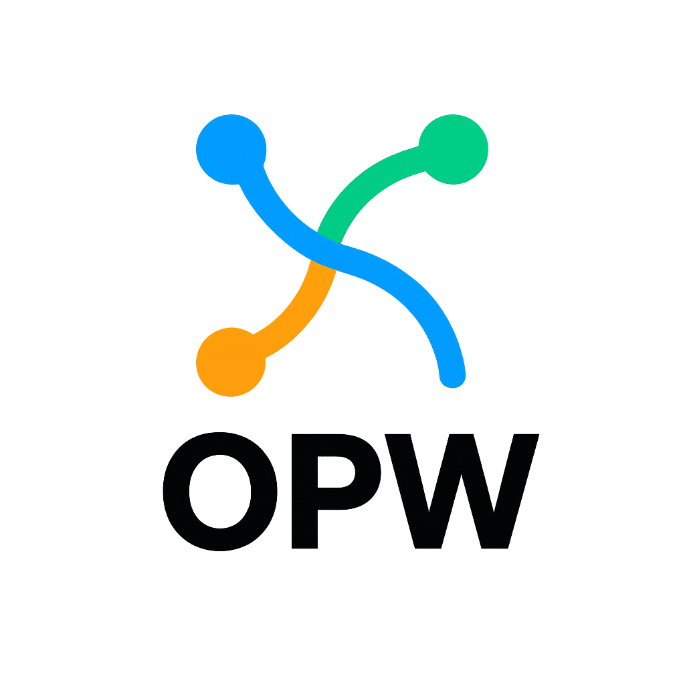

# OPW: A Living Behavioral Architecture for the Post-Server Era



> A language for developers who are done fighting structure—and ready to speak in behavior.

---

## 🧠 Why OPW?

Legacy systems still punch:
- Central APIs, manual injection, heavy loads, repeated logic
- Devs buried in docs just to understand basic flows
- Servers crushed under redundant traffic

We said: Enough.

---

## 🚀 What is OPW?

OPW is a behavioral language—not a framework, not a tool, not another class.

With one line, the developer simply declares intent:

```bash
opw add login auth smsotp parsgreen

And the system understands:
- What the parent function is
- Which child functions to inject
- What dependencies are needed
- How to combine them

🧩 Core Concepts
- Parent Function: Defines the behavioral path, not the execution.
- Child Functions: Injected from central memory, composable and replaceable.
- opw_pack: Behavioral wrapper that describes what the function is, what it needs, and how it connects.
- Central Memory: Knows everything—what exists, how it connects, and what should be executed.

☁️ Serverless: A Servant, Not a Master
In OPW, behavioral paths become serverless endpoints:
GET https://mygod.com/login → auth → login → user_login()


- Light behaviors (e.g. reading articles) → edge servers with short TTL
- Heavy behaviors (e.g. login + purchase + tracking) → centralized servers with cache and queues

🏢 Big Companies: Controlled Collaborators
- They can build private middleware for their proprietary functions
- Only they can access those functions
- Shared logic (the stuff buried in docs) goes into central memory
- Developers don’t need to read endless documentation—they just declare what they want

🔥 Why It Matters
Because we’re not chasing perfection.
We’re building living architecture—understandable, composable, negotiable.
OPW is not a framework.
It’s a language for behavioral composition, negotiation, and growth.

🌐 Translations
- فارسی
- العربية
- Français

🤝 Contribute
This is just the beginning.
If OPW speaks to you, help it grow.
Open a PR, share feedback, suggest new behaviors—or just star the repo to let us know you’re watching.
