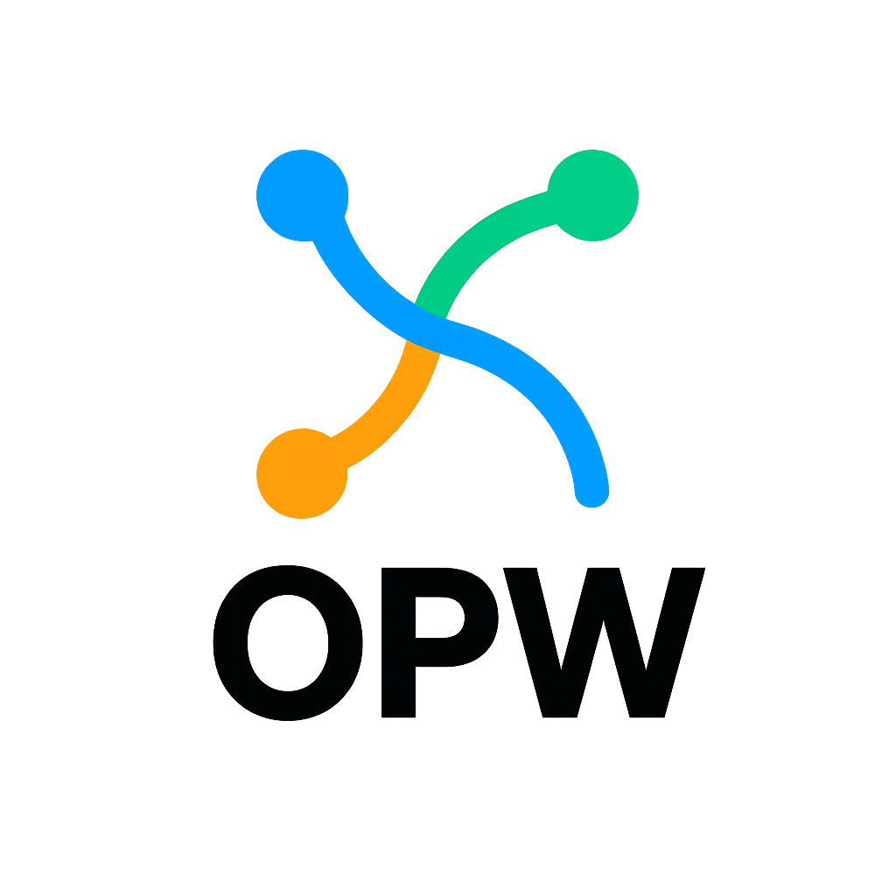

# OPW: هندسة سلوكية حيّة لعصر ما بعد الخوادم



> لغة للمطورين الذين تعبوا من القوالب، ويريدون الحديث بالسلوك.

---

## 🧠 لماذا OPW؟

الأنظمة التقليدية ما زالت تضرب:
- واجهات مركزية، حقن يدوي، حمل زائد، منطق مكرر  
- المطور غارق في الوثائق لفهم أبسط المسارات  
- الخوادم تنهار تحت ضغط الطلبات المتكررة

قلنا: كفى.

---

## 🚀 ما هي OPW؟

OPW هي لغة سلوكية—not إطار عمل، ولا أداة، ولا صنف جديد.

بسطر واحد، يعلن المطور ما يريد:

```bash
opw add login auth smsotp parsgreen

والنظام يفهم:
- ما هي الدالة الأم
- ما الدوال التي يجب حقنها
- ما التبعيات المطلوبة
- كيف يتم الدمج بينها

🧩 المفاهيم الأساسية
- الدالة الأم: تحدد المسار السلوكي—not التنفيذ
- الدوال الفرعية: تُحقن من الذاكرة المركزية، قابلة للدمج والاستبدال
- opw_pack: غلاف سلوكي يصف وظيفة الدالة، احتياجاتها، وكيفية ارتباطها
- الذاكرة المركزية: تعرف كل شيء—ما الموجود، كيف يرتبط، وما الذي يجب تنفيذه

☁️ Serverless: منفذ، لا مهندس
في OPW، المسارات السلوكية تصبح نقاط نهاية serverless:
GET https://mygod.com/login → auth → login → user_login()


- السلوكيات الخفيفة (مثل قراءة المقالات) → خوادم edge بمدة صلاحية قصيرة
- السلوكيات الثقيلة (مثل تسجيل الدخول + الشراء + التتبع) → خوادم مركزية مع التخزين المؤقت والطوابير

🏢 الشركات الكبرى: شركاء تحت السيطرة
- يمكنهم بناء middleware خاص لوظائفهم الحصرية
- فقط هم يمكنهم الوصول إليها
- المنطق المشترك (المدفون في الوثائق) يوضع في الذاكرة المركزية
- المطور لم يعد بحاجة لقراءة آلاف الصفحات—فقط يعلن ما يريد

🔥 لماذا هذا مهم؟
لأننا لا نبحث عن الكمال.
نحن نبني هندسة حيّة—قابلة للفهم، للدمج، وللتفاوض.
OPW ليست إطار عمل.
إنها لغة للتركيب السلوكي، التفاوض، والنمو.

🌐 الترجمات
- English
- فارسی
- Français

🤝 شارك
هذه مجرد بداية.
إذا تحدثت إليك OPW، ساعدها على النمو.
افتح PR، شارك أفكارك، اقترح سلوكيات جديدة—أو فقط ضع نجمة لتخبرنا أنك هنا.
